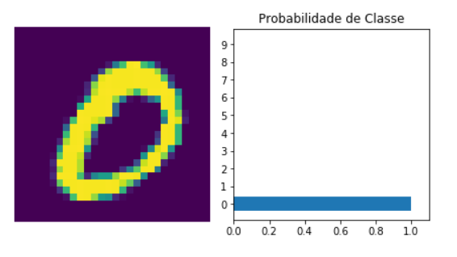

# Artificial Intelligence Models (Deep Learning, RNN, CNN...)

## Folder: Frameworks
Models using frameworks as: TensorFlow 2.0 with Keras and PyTorch  
Image Recognition  
Data: Dataset MNIST Digits  
Example:  

