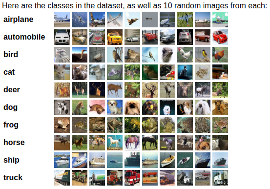
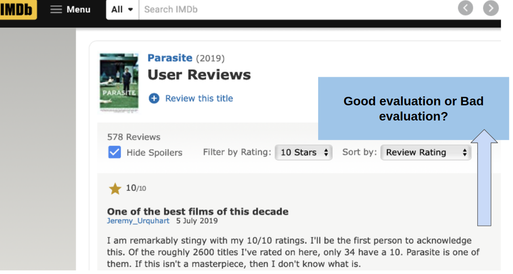
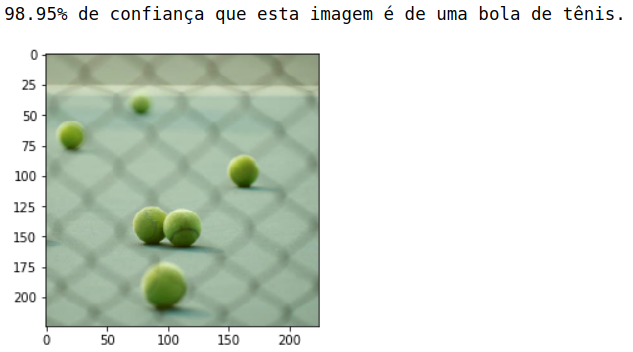
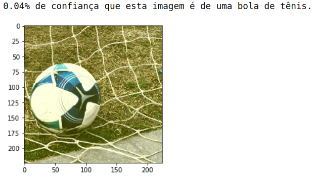
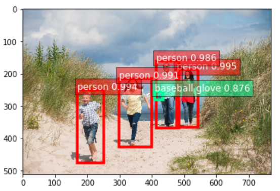

# Artificial Intelligence Models (Deep Learning, RNN, CNN...)

## Folder: Frameworks
### Models using frameworks as: TensorFlow 2.0 with Keras and PyTorch  
Image Recognition  
Data: Dataset MNIST Digits  
Example:  

### Models using frameworks as: PyTorch  
Image Recognition  
Data: CIFAR10  
Example:  

### Models using frameworks as: PyTorch  
NLP Sentimental Analysis  
Data: Imdb to movie's reviews and Stanford to sentimental labels  
Example:  

### Models using frameworks as: MxNet and GluonCV  
Object Recognition in Images 
Model: Model Pre-trained from GluonCV
Data: COCO Images  
Example:  

### Models using frameworks as: MxNet and GluonCV  
Object Recognition in Images Detecting Multiple Objects 
Model: Model Pre-trained from GluonCV
Data: COCO Images  
Example with detected objects:  
  
Example with instace segmentation:  
